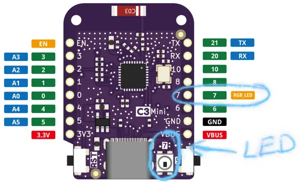
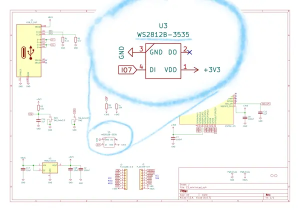
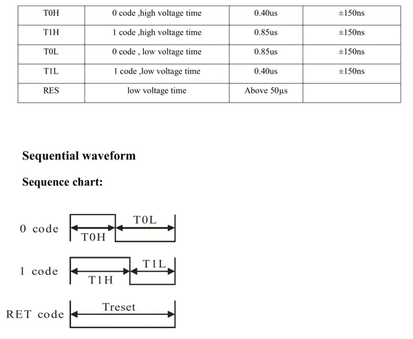

[Last time](@/posts/small-thing/index.md) we left off by failing to get the integrated LED to light up.
We were following the "blinky" example in
`esp32c3-hal`, which is pretty simple: the main loop looks just toggles the pin's voltage from
low to high and back again, one cycle per second. There's not much that can go wrong besides choosing the wrong pin,
and we double-checked that already: pin 7 is the one hooked up to our LED.



That pin diagram gives us our first hint for what's gone wrong: pin 7 is marked as an `RGB_LED` instead of just a LED.
(There's also a [Lolin C3 mini v1.0.0](https://www.wemos.cc/en/latest/c3/c3_mini_1_0_0.html) that has a normal LED, but we're using the v2.1.0.)
What's an RGB LED? A google search turned up LEDs with [four pins](https://www.sparkfun.com/products/105): a common ground and then
one pin for each color. But our RGB LED has only one pin besides the ground, so we must have something different.

Our next hint comes from our board's [schematics](https://www.wemos.cc/en/latest/_static/files/sch_c3_mini_v2.1.0.pdf),
which shows IO 7 connected to something that's labelled `WS2812B-3535`.



A quick google turns up a [datasheet](ws2812b-spec.pdf).
Instead of a mere analog LED,
it appears we have an "Intelligent control LED integrated light source," which we control using a simple communication
protocol described in that linked datasheet. The main parts are this:


which says we need to send 24 bits of color data by transmitting (in big-endian order) a byte of green, a byte of
red, and then a byte of blue. (I'm pretty sure the diagram has three blocks of 24 bits each because it's showing
how you would transfer data if you had three LEDs wired up in series. We only have one LED, so we just need one
block of 24 bits, followed by the reset code.) And then this:



tells us how to send each bit: a 1 bit is sent by setting the pin high for 850ns and then low for 400ns, and a 0 bit
is sent by setting the pin high for 400ns and then high for 850ns. After sending all 24 bits, we finish up by setting
the pin low for 50µs.

## Bit-banging the WS2812

Since the procotol is simple, we can implement it bare-hands:

```rust
// Transmit a 1 to the LED.
let mut one = || {
  io7.set_high().unwrap();
  delay.delay_ns(850);
  io7.set_low().unwrap();
  delay.delay_ns(400);
};

// Transmit a 0 to the LED.
let mut zero = || {
  io7.set_high().unwrap();
  delay.delay_ns(400);
  io7.set_low().unwrap();
  delay.delay_ns(850);
}

// Send G = 0, R = 255, B = 0.
zero(); zero(); zero(); zero(); zero(); zero(); zero(); zero();
one(); one(); one(); one(); one(); one(); one(); one();
zero(); zero(); zero(); zero(); zero(); zero(); zero(); zero();
// 40µs of "low" to finish.
delay.delay_us(40);
```

Unfortunately, we can't do this because there is no `delay_ns` function:
`esp32c3`'s [`Delay`](https://docs.rs/esp32c3-hal/latest/esp32c3_hal/struct.Delay.html) only supports microsecond
resolution. I'm not completely sure why, because [apparently](https://github.com/esp-rs/esp-hal/blob/0c47ceda3afbc71dc2f540589811257eab51199f/esp-hal-common/src/delay.rs#L72)
the underlying timer runs at 16MHz, but anyway there are less brute-force ways to speak to our WS2812B.

## The SPI protocol

I learned about this first method from the [ws2812-spi-rs](https://github.com/smart-leds-rs/ws2812-spi-rs) crate,
which I found by searching for "ws2812" on crates.io. The idea is that the [Serial Peripheral Interface](https://en.wikipedia.org/wiki/Serial_Peripheral_Interface)
is close enough to what we want that we can manipulate it into talking to our LED.
The SPI protocol has a fixed clock speed and it sends one bit per clock tick by setting a pin high for a 1 or low for a 0.
In contrast, each bit in the WS2812's protocol needs the pin to be high and then low (for durations depending on the
bit we're sending).
For example, the nibble `1101` gets represented like this in our two protocols:


Clearly they aren't the *same* protocol, but just from looking at the diagram you can see how the WS2812's protocol
can be emulated using SPI: we set the SPI frequency higher; then we send a WS2812 1 by sending several
SPI 1s followed by an SPI 0, and we send a WS2812 0 by sending an SPI 1 followed by several SPI 0s.

We have to do a little math to get the timings to line up. First up, I lied a little bit earlier: the WS2812's timings
don't need to be exactly 850ns for the long pulse and 400ns for the short pulse: you get ±150ns of slack on both of those timings.
So if we set the SPI clock to 3.33 MHz then one clock cycle (300ns) is suitable for a short pulse and three clock cycles (900ns) is
suitable for a long pulse. Then we can sent a WS2812 1 by sending `1110` on this faster SPI interface,
and a WS2812 0 by sending `1000`. For example, to send the nibble `1101` as above, we replace each 1 by `1110` and each `0`
by `1000` to get `1110111010001110` and then we send that along our faster SPI interface like this:


And it works! I implemented it [here](https://github.com/jneem/esp-examples/blob/main/blinky/src/bin/spi.rs); running
`cargo run --bin spi` finally gives me a life sign from the onboard LED.

## The RMT peripheral

I didn't realize when I started, but the `esp32c3-hal` has an example for us after all: it's called
[`hello_rgb`](https://github.com/esp-rs/esp-hal/blob/0c47ceda3afbc71dc2f540589811257eab51199f/esp32c3-hal/examples/hello_rgb.rs).
It talks the WS2812's protocol using (by way of the `esp_hal_smartled` crate) the "Remote Control Transceiver (RMT)" peripheral.
According to [Espressif's documentation](https://docs.espressif.com/projects/esp-idf/en/latest/esp32c3/api-reference/peripherals/rmt.html),
the RMT was originally designed as an infrared transceiver (hence the name), but has grown to be
"a versatile and general-purpose transceiver, transmitting or receiving many other types of signals."

One nice thing about RMT is that it has built-in support for the sort of long-short/short-long pulses we want, without
needing to fake them: the `esp32c3_hal::rmt` module provides a `PulseCode` struct that can express our protocol
like this:

```rust
// The pulse for a 1 bit in WS2812's protocol:
let one = PulseCode {
  level1: true,  // Start by setting the pin high...
  length1: 68,   // for 68 cycles, which is 850ns at the default 80 MHz clock speed.
  level2: false, // Then set the pin low...
  length2: 32,   // for 32 cycles, which is 400ns.
};

let zero = PulseCode { /* similar */ };

// Just zero for 4000 cycles.
let reset = PulseCode {
  level1: false,
  length1: 0,
  level2: false,
  length2: 4000,
};
```

I wrote a small example [here](https://github.com/jneem/esp-examples/blob/main/blinky/src/bin/rmt.rs)
that uses the RMT peripheral to talk to our onboard LED. It works just as well as the SPI example.

## Which peripheral should you use?

You can use either the RMT or the SPI peripheral to communicate with the Lolin C3 Mini v2.1.0's onboard LED.
But which way is better? The honest answer is "I don't know," but here are a few relevant factors:
- The ESP32-C3 has only one general-purpose SPI controller, according to
  [this](https://docs.espressif.com/projects/esp-idf/en/v5.1.1/esp32c3/api-reference/peripherals/spi_master.html).
  So if you need the SPI bus for a non-LED purpose, you'll need to use RMT for the LED.
  There are [four](https://docs.rs/esp32c3-hal/latest/esp32c3_hal/rmt/index.html) RMT channels, two for sending
  and two for receiving. So the SPI controller seems to be the more precious resource.
- The in-memory encoding of the signals is more efficient for SPI: we used four bits in-memory to encode one
  bit of protocol (we could have made do with three bits but four was easier). The RMT encoding uses a `u32` (four *bytes*)
  for each bit of protocol. Given that we only 24 bits to send, this discrepency probably doesn't matter.
  But if we had a lot of LEDs to control, maybe it would make a difference.
- The SPI method is less "blocking:" there is support (which I might write about later) for async operations
  on the SPI bus, while the RMT code in `esp-hal` does a [busy loop](https://github.com/esp-rs/esp-hal/blob/2f5ebad9fe9f8f7186a43e16b29e578b22eac47f/esp-hal-common/src/rmt.rs#L337)
  until sending is complete.
- The `esp-hal-smartled` crate uses RMT, so you'll need to use RMT also if you want to use their utilities.