[Linesweeper](https://github.com/jneem/linesweeper) is a library that
takes shapes (defined by Bézier curves) as input, and computes their union,
intersection, or other related operation (let's call these operations "boolean ops").

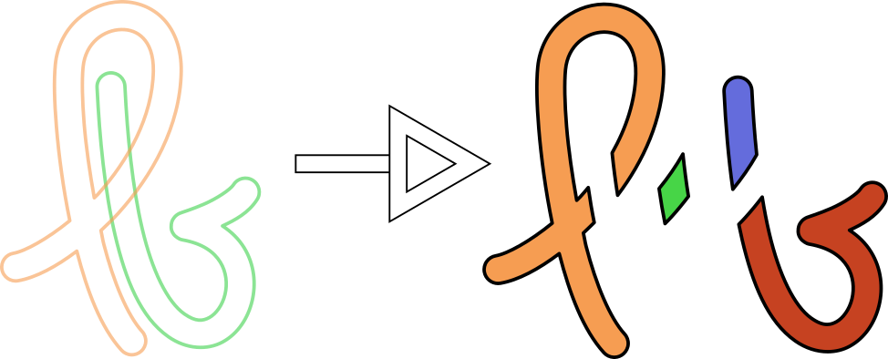

No big deal, really: programs like Illustrator and Inkscape have been able to do
this for decades, and there are multiple open-source implementations available,
for example in
[CGAL](https://doc.cgal.org/latest/Boolean_set_operations_2/index.html#Chapter_2D_Regularized_Boolean_Set-Operations),
[Paper.js](https://github.com/paperjs/paper.js),
[lib2geom](https://gitlab.com/inkscape/lib2geom) (as used by Inkscape), or
[Geom2D.CubicBezier](https://hackage.haskell.org/package/cubicbezier) (as used by [Diagrams](https://diagrams.github.io/)).

But I had some reasons to try my own thing:
 - None of the existing implementations were easy to use in Rust, and I think there's some
   demand for a good Rust implementation; it's a popular feature request for kurbo,
   for example.
 - I wanted access to certain low-level operations that aren't exposed by existing packages.
 - Sometimes it's just fun to do something yourself.
 - It's surprisingly hard to do correctly and robustly, and I wanted to try a new approach.

I think these are all valid reasons, but I want to really focus on the last one.

# What makes it hard?

The basic ideas aren't too hard to explain: as an example, suppose we want the union
of two shapes.

The first step is to compute all the intersection points of the shapes' boundaries.

Then we'll use these intersection points to determine the boundary of the union. Starting
from the top, we'll "trace" the boundary, keeping the union to our left as we go (either
way would work, as long as we're consistent).

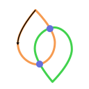

Whenever we get to an intersection point, we turn right. If there are multiple choices, we take
the right-most one.

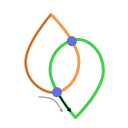

And that's all! Once we get back to our starting segment, we've traced out the union.
(Ok, if the original sets had holes then there's some more work to be done to find holes
in the union. But that's pretty similar to the steps we've already done.)

The exact details of the tracing algorithm aren't that important here, but the key takeaway
is that it's pretty simple once you know two important things: the locations of all
the intersections of all the boundary segments, and "how" those boundary segments meet there
(like, what's the clockwise order of the segments at an intersection point).

## Numerical issues

When you actually try to implement this, finding the intersections already presents some problems. We like to
use floating point numbers for problems like this because they're pretty accurate and very
fast on modern computers. But floating-point calculations invariably involve approximations
and they can sometimes be wrong. For example: does the line segment from
$(0, 0)$ to $(1, 3)$ intersect the line segment from $(2, 2)$ to
$(0.5, 1.5) + (3, 10) \times 2^{-53}$?
In fact it does (because $(0.5, 1.5) + (3, 9) \times 2^{-53}$ lies exactly on
the segment from $(0, 0)$ to $(1, 3)$), but a numerical implementation
might claim that they don't. (In fact, I came up with this example by exhaustively searching
for line segment intersections that [kurbo][kurbo-line-intersect] gets wrong.)

[kurbo-line-intersect]: https://docs.rs/kurbo/latest/kurbo/enum.PathSeg.html#method.intersect_line

If you're only comparing individual segments, you might not care: you're doing approximations
and you got an approximate answer. But when you have a path made up with multiple segments,
small errors on individual segments can conspire to mess things up on a larger scale. If we fail
to detect that segment A intersects with segment B (which is defensible) and we *also* fail to
detect that it intersects
with segment C (also reasonable), we might fail to notice that these two *paths* intersect,
and that's definitely wrong.

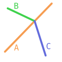

You can try to fix this by tweaking your intersection-finding code to also report
almost-intersections, but it can be tricky to *consistently* turn almost-intersections
into intersections across different path segments. For example, in the configuration above,
it doesn't matter exactly which intersections we detect, but it's important that
we see the B-C path as crossing the A segment exactly once.

## Existing approaches

There are a few approaches I know for handling these numerical issues.

- Use exact math. This is relatively easy if you only support paths made out of straight lines,
  because straight lines between integer endpoints can only intersect at rational coordinates.
  It's more challenging -- but still possible -- to support paths made out of Bézier curves:
  you "just" need to compute with [algebraic numbers](https://en.wikipedia.org/wiki/Algebraic_number).
  This is the approach used by CGAL. The main disadvantage of exact math is the computational
  cost of doing exact math. But also, if you want to get the answer out in floating point
  then you need a rounding step at the end anyway.
- Use exact math, but only for *detecting* intersections. This is commonly used for handling
  paths made out of straight lines, because there's an [algorithm][robust orientation]
  for it that's much faster than generic exact arithmetic. I don't know of anyone doing this
  for paths with curved segments.
- Use approximate math, and try to handle all the corner cases. This is what most implementations
  do, but it feels a bit unsatisfying to me.

[robust orientation]: https://www.cs.cmu.edu/~quake/robust.html

# Linesweeper's goals

So what do I want out of this new boolean ops algorithm?
The big one is this: it should be correct *by design*, while
avoiding exact math. I want to use inexact floating point
arithmetic (for speed), and I want our algorithm to be robust
to rounding errors.

I also want a reasonably strong definition of correctness. I'll
allow the algorithm to perturb the input curves (this is unavoidable,
as you can't represent the intersection points otherwise), but after
that perturbation I want the output to be exactly correct: all the output
curves should intersect one another only at endpoints:

In the picture above, I'm taking the union of the orange and blue shapes
at the top left. The two green outcomes are acceptable: the two inputs
can be perturbed to not touch, in which case the union has two disjoint parts.
Or they can be perturbed to overlap, in which case the union gets fused
into a single piece. The red outcome, however, is forbidden.

In addition to being correct, I'd like the algorithm to be fast. After all,
that's the main point of avoiding exact arithmetic. At this stage of development,
I'm not too worried about optimizing constant factors in the implementation,
but I want it to scale well to higher accuracy and larger inputs.

# The classical sweep-line algorithm

The first point to address is the search for all intersections between paths.
There's a classical, simple, and efficient algorithm for this: the
[Bentley-Ottmann][bentley-ottmann] sweep line algorithm. This will be the basis for
our robust intersection finder, so let's begin with a quick outline of the
classical algorithm, which was originally described for straight line segments
using exact arithmetic.

[bentley-ottman]: https://en.wikipedia.org/wiki/Bentley%E2%80%93Ottmann_algorithm

The Bentley-Ottmann algorithm sweeps a horizontal line (the "sweep line") from top to bottom,
keeping a list (ordered from left to right) of the path segments that cross it.
As the sweep line advances downwards, there are three interesting things that can happen:
it can touch a new segment that wasn't already in the sweep line (we say that the segment "enters"
the sweep line), it can move past the end of a segment (we say that the segment "exits" the sweep line),
or it can pass the intersection point of two segments.

When a segment enters the sweep line, we insert it at the appropriate index[^data-structure]. Then we look
at the neighboring segments to the left and right to see if they intersect with the new segment.
If so, we make a note of the intersection point so we can handle it when the sweep line passes it.

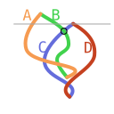

For example, here the sweep line contains (A, B). Then C enters and we insert it at the
appropriate place (after B), and we note that it will intersect with C pretty soon (circled
in black). We don't
yet compare C with A, though.

When two segments in the sweep line cross one another, we swap their positions
and then re-check them for intersections with their new neighbors.

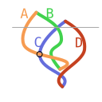

For example, here the sweep line is at the previously-recorded crossing of B and C.
So we swap their order -- the sweep line goes from (A, B, C, D) to (A, C, B, D).
Then we compare both B and C against their new neighbors, and make a note that C will
cross A at some point (circled in black).

When a segment exits the sweep line, we remove it from the sweep line data structure, and then
we check whether its two neighbors intersect each other (and make a note of the intersection point
if they do).

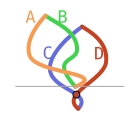

For example, here both A and B exit at the sweep line. After that, C and D are neighbors
so we compare them and note that they'll cross one another soon.

The key to this algorithm's efficiency is that for reasonable inputs, it
avoids comparing most pairs of segments: each segment in the sweep line is only
compared to its left and right neighbors.

# A two-phase strategy

The first novel (to me, at least) part of our robust sweep line algorithm is that
it comes in two parts: first, we run a sweep line algorithm to determine the ordering
of all our segments. Only once the ordering is decided do we fix the positions.
This two-phase split sounds minor, but it makes
corner cases much simpler: whenever you assign positions to segments, you
perturb them. And whenever you perturb them, you might affect the validity of
things you've already calculated.[^cautionary example] By looking after the ordering first,
and then later assigning the positions all at once, you can avoid this problem.

## The ordering phase

Here's a little example of what the ordering phase does: we have four segments (A, B, C, D).

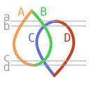

And as we sweep the sweep line down the picture, there are four heights where the ordering changes.
Initially, the ordering is (A, B). At height a, it switches to (A, B, C, D). At height b,
it switches to (A, C, B, D), and height c, it switches back to (A, B, C, D), and at height
d it changes to (C, D). This sequence of orderings actually encodes all the information about
entrances, exits, and intersections: at height a, the order changed from (A, B) to (A, B, C, D)
and so we know that C and D entered. At height b, the order changed from (A, B, C, D) to
(A, C, B, D), so we know that B and C crossed one another. Even though we haven't figured
out horizontal positions for the various crossings, this is already enough information
to do the *topological* part of boolean ops, by which I mean that you can use the algorithm
at the beginning of this post to figure out that the union of these two shapes
is traced out by following A down to height d, and then B up to height c, and then C down to the end, and then D up
to height a, and so on.

They key primitive for the ordering phase is an [algorithm] that takes two (monotonic in y)
curves and figures out their horizontal order. For each vertical range, the algorithm is
allowed to output "left", "right", or "close." So in the following example,
it might say that A is to the left up until height a, and then they're close up until height b,
and then A is to the right after that.

[algorithm]: https://github.com/jneem/linesweeper/blob/b7986c6f36b3c3a90227e96ad4cdd1639bb36fdc/src/curve/mod.rs#L1171

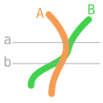

This pair-wise curve ordering primitive was [proposed] by Raph Levien a couple
years ago, and it's such an important part of our robustness story that I'll put this
in bold for the skimmers to see: **the key to robustness is to look for *orderings* instead
of intersections**. Unlike the
intersection-finding approach that is usually used, this approach doesn't get confused by
near-intersections near the endpoints of segments.

[proposed]: https://github.com/linebender/kurbo/pull/258

Like, in this example from before, the ordering approach just says that B starts out to the left of A,
and then they get close, and then C is close to A, and then C is to A's right. It doesn't even try
to figure out which of B or C intersects A, because we just don't care.

In order for this primitive to be a useful building block, we impose some requirements. Without getting too
much into the technical details, if the curves are very close we require that the answer is "close,"
and if the curves are clearly ordered, we require the answer to be correct. In intermediate cases,
one of two answers is allowed. For example:

Above height a, the comparison *must* say that A is on the left. Within the a region, it can say either
"left" or "close" (and is even allowed to alternate between the two). Between heights a and b,
it *must* say "close". Within the b region, it can say either "right" or "close", and below b
it *must* say "right".

Using this approximate pair-wise comparison, we build a sweep line algorithm that guarantees
approximate ordering: whenever curve A is definitely to the left of curve B according to
our approximate comparison then it should precede B in the sweep line.
There are a few tricky parts to the sweep line algorithm, because

- we need the ordering guarantees to hold for *all* pairs of curves in the sweep line,
  not just adjacent pairs of curves; and
- we want to avoid comparing all pairs of curves in the sweep line, like how the
  classical Bentley-Ottmann algorithm only ever compares adjacent curves.

Here's an example of a tricky case:

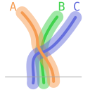

Initially, (A, B, C) is the only valid sweep line order. At the marked height,
our pairwise comparison is still allowed to say that A is close to B and B is
close to C. If we only look at those adjacent comparisons, we might think that
(A, B, C) is still a valid sweep line at that height. But clearly that isn't the
case, since C is left of A.

This example shows that (unlike Bentley-Ottmann) our approximate sweep line
needs more than just nearest-neighbor comparisons: when there are multiple
nearby neighbors, it keeps scanning until it sees a gap large enough to know
that it doesn't need to look any further. This "large enough gap" test is implemented
with the same pair-wise curve comparison algorithm, just with a larger threshold
for the meaning of "left" and "right".

## The positioning phase

In the second phase, we physically lay out our segments, while respecting
the orders that the first phase chose for us. It turns out (surprisingly
to me, at first) that producing Bézier curves with a guaranteed horizontal
order is easier than checking the order of some given curves: the latter I
can only do approximately, but the former I can do exactly. The trick
is that if you have two Bézier curves and their control points have the
same $y$ coordinates and ordered $x$ coordinates, the curves are guaranteed
to also be ordered. In the picture below, we can tell that curve A is to
the right of curve B just by comparing their control points (the black
control points are common to both curves).

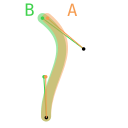

Therefore our strategy for outputting correctly ordered segments is to simultaneously
approximate all segments with Bézier curves that all share the same control
point $y$ coordinates. If the approximation isn't good enough, subdivide and try
again. If the approximation is good enough, apply some maxes and mins to the
control point $x$ coordinates to ensure the correct order.

The most complex part of this scheme is the part that tries to avoid doing it,
because we'd prefer not to approximate and subdivide if we don't have to.
So we conservatively detect regions where the order needs to be enforced. Outside
of those regions, we simply copy the input segments to the output.

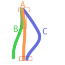

In this example, the three curves are close to one another at the top, so in the
top rectangular region we'll have to approximate and subdivide. But pretty soon
`C` moves far away, so in the second rectangular region we'll only approximate
and subdivide `A` and `B`. Near the bottom, we'll approximate and subdivide `A`
and `C` while leaving `B` alone.

# Where we're at

The algorithm described above is implemented (in Rust)
in the [linesweeper](https://github.com/jneem/linesweeper) crate, which recently
released verson `0.1.0`. That version number probably gives the right idea
of the implementation's maturity: it should basically work, but there are still
lots of improvements to be made to correctness, performance, and clarity
of implementation. But you can give it a try and report issues! If you'd like
it to run particularly slowly and crash a lot, you can use it with the `slow-asserts`
feature, which exhaustively checks all the ordering invariants that we're
supposed to uphold.

# Acknowledgement

None of this would have been done without the advice and encouragement of the
[linebender](https://linebender.org) community, especially that of Raph Levien.
In particular, the implementation of curve comparison is heavily based on
[his code](https://github.com/linebender/kurbo/pull/258), and I learned about the
approach to guaranteed output ordering from conversations with him on the
[linebender zulip](https://xi.zulipchat.com/).

[^data-structure]: using some kind of tree structure for fast searching and insertion

[^cautionary example]: For a cautionary example, the [geo](https://crates.io/crates/geo)
was using a sweep line algorithm that had a bunch of bugs caused by perturbations
unexpectedly breaking their invariants. These were eventually fixed by ditching
their custom implementation and [switching] to the `i_overlay` crate, which uses
a variant of the exact math approach (implemented in fixed precision for speed).

[switching]: https://github.com/georust/geo/commit/4915dfc7db11cd8e94e3c89329295a8d5db72b77
