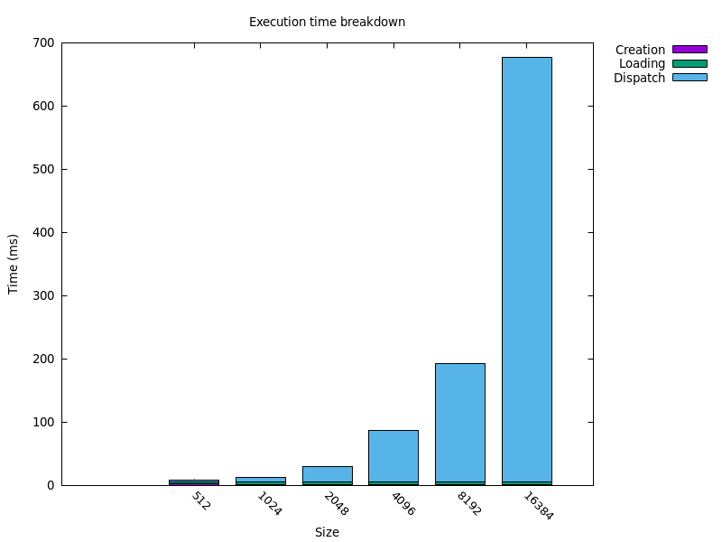

Matt Keeter posted his [Prospero challenge] in March, and for a couple of months
I did an excellent job of focusing on my other free-time projects and resisting
the urge to jump in. That ended last week.

[Prospero challenge]: https://www.mattkeeter.com/projects/prospero/

For a proper description of the problem, see the [original post][Prospero challenge].
But the basic idea is that we have a giant list of almost 8000 instructions:

```text
_0 const 2.95
_1 var-x
_2 const 8.13008
_3 mul _1 _2
_4 add _0 _3
... and 7861 more
```

and we want to execute them as fast as possible, many times in parallel.
There are already a bunch of great write-ups linked from the main Prospero challenge
page, and most of them fall into two categories: *interpreters*,
programs that iterate over the instructions to compute the result, and *JIT
compilers*, programs that iterate over the instructions and emit machine code, which
then gets executed to produce the result.
One interesting solution emitted CUDA source code instead of machine code.
Then it compiled the CUDA source and executed it on a GPU. The execution time was
super fast, but the compilation step was very slow.

This post is about a sort of a JIT compiler, but one that outputs code for the GPU
instead.[^process] The first challenge is to figure out what kind of code to output.
Most CPUs have a standardized instruction set (either ARM or x86_64 for most desktop
CPUs), but GPUs don't: every GPU generation from every manufacturer does its own thing.
Nvidia has [PTX], an instruction set that's portable among their own GPUs, but I don't
have an Nvidia GPU.

[PTX]: https://docs.nvidia.com/cuda/parallel-thread-execution/index.html

On non-Nvidia GPUs, [SPIR-V] appears to be the most useful compilation target. It's
the intermediate representation used by Vulkan, and so any Vulkan video driver knows
how to compile SPIR-V into the GPU's native instruction set. Hopefully those compilers
are fast! [^lower]


[SPIR-V]: https://en.wikipedia.org/wiki/Standard_Portable_Intermediate_Representation

[shader compilation process]: https://docs.mesa3d.org/drivers/radv.html#shader-compilation


# Emitting SPIR-V

I was relieved to discover that there's a crate ([`rspirv`]) for emitting
binary SPIR-V code in Rust. They even have a [builder] with a convenient interface
for building SPIR-V modules! Well, sort of convenient: SPIR-V is quite low-level
and explicit, and it demands that you bind variables to everything that you
want to refer to. For example, you can't just say that you want to declare
a `void` function returning `void`. Instead, you have to first bind the `void` type
to a variable, then bind the `void-function-returning-void` type to a variable,
and then finally you can declare your function. In `rspirv` it looks like this:

[`rspirv`]: https://github.com/gfx-rs/rspirv
[builder]: https://docs.rs/rspirv/latest/rspirv/dr/struct.Builder.html

```rust
let mut b = rpsirv::dr::Builder::new();
let void = b.type_void();                      // declare the void type
let voidf = b.type_function(void, vec![void]); // declare the void -> void type
let f = b.begin_function(void, None, FunctionControl::None, voidf);
```

If you want to add `1.0` to a floating point number, first you need to declare the
floating point type, then the floating point constant `1.0`, and only then can
you create the addition instruction:

```rust
let float = b.type_float(32);
let float_1 = b.constant_bit32(float, bytemuck::cast(1.0f32));
let result = b.f_add(float, None, float_1, x).unwrap();
```

To make things more fun, `void`, `voidf`, `f`, `float`, and `float_1` are represented
in Rust by the same [type], so there's nothing to prevent you from accidentally
trying to add some thing to the float *type* instead of the floating-point constant
`1.0`. If you mess something up then the Vulkan runtime will helpfully
segfault without telling you where the problem is.

[type]: https://docs.rs/spirv/0.3.0+sdk-1.3.268.0/spirv/type.Word.html

To actually get things working, I made heavy usage of the [`spirv-val`] tool
to debug problems with my generated code. To figure out how to express things
in SPIR-V, I also looked at a bunch of generated disassembly from the reference
[`glslang`] compiler, without which I never would have figured out how
to access the built-in `gl_GlobalInvocationId` variables or how to write to
the output buffer.

[`spirv-val`]: https://github.com/KhronosGroup/SPIRV-Tools
[`glslang`]: https://github.com/KhronosGroup/glslang

Once I'd figured out the basics, translating instructions to SPIR-V was pretty
straightforward. The main loop looks something like this:

```rust
  // Map the line names in the input file to their SPIR-V variables
  let mut vars = HashMap::<&str, Word>::new();
  for line in insts {
      // Skip comments
      if line.starts_with('#') {
          continue;
      }
      let mut parts = line.split_whitespace();
      let name = parts.next().unwrap();
      let op = parts.next().unwrap();
      let var = match op {
          "const" => {
              let val: f32 = parts.next().unwrap().parse().unwrap();
              b.constant_bit32(ty_float, bytemuck::cast(val))
          }
          "add" => {
              let op0 = vars[&parts.next().unwrap()];
              let op1 = vars[&parts.next().unwrap()];
              b.f_add(ty_float, None, op0, op1).unwrap()
          }
          // ... and the rest of the ops
      };

      vars.insert(name, var);
  }


```

# Does it go fast?

Sort of, yes! The binary as a whole isn't super quick, because initializing the GPU
resources takes a little while. But after about 50ms of setup time, it took about 12ms
to read the input data, create and assemble the binary SPIR-V code, load it on the GPU,
and render out a 1024×1024 image. We can break down that 12ms further:

| stage | time (ms) |
--------|-----------|
|shader creation | 1.5 |
|shader loading | 3.7 |
|dispatch | 6.8 |

Here, "shader creation" includes the time to parse the input file and call `b.begin_function`
and so on. "Shader loading" is just the call to `vulkano::shader::ShaderModule::new`, which I
think is where shader compilation happens,[^caching] and "dispatch" consists of running the shader
and reading back the filled buffer.
As a point of comparison, Ken Micklas's [vectorized JIT] implementation took 38ms on my machine.
So 12ms seems pretty good, especially if we can further reduce the shader creation and loading
time by targeting a lower-level representation.

[vectorized JIT]: https://tech.kmicklas.com/posts/prospero/

Increasing the problem size scales a little better than I'd expect: doubling the sizes
quadruples the number of pixels, but the runtime seems to consistently rise by less than
a factor of four. I suspect this is caused by the GPU clocking up for the longer computations.
I tried forcing my GPU to max power[^max power], and it sped things up quite a lot --
1024×1024 went from 6.8ms to 2.6ms -- but it also consistently crashed my machine at
size 8192. So all these measurements are with the default power settings.



The main take-away here is that 1024×1024 is about the size where setup time
and execution time are roughly comparable. Much larger than that, and the execution
time dominates.

The source code of this implementation is [here](https://codeberg.org/jneem/prospero-gpu/src/branch/main/src/bin/spirv-runner.rs).

# What next?

We've only explored brute-force computations so far, but apparently the [really fast]
and scalable way to do this sort of thing is via interval arithmetic and expression
simplification. I'd like to explore these techniques on the GPU, where we might
face different tradeoffs with setup time and execution time: we'll have to compile
a new shader for each simplified expression, so it probably makes sense to do
bigger batches and less simplification.

[really fast](https://www.mattkeeter.com/projects/fidget/)

[^process]: I actually started out by trying to write a fast GPU interpreter,
but it was hard. I may write about some of the issues that I had and the benchmarks
that I run, but it's more fun to first write about the part that worked.

[^lower]: If we're willing to give up platform portability, we could
look into Mesa -- the Linux graphics framework -- more directly. For modern AMD
cards, their [shader compilation process] has two stages: compilation from SPIR-V
to NIR (their native intermediate representation), and then compilation to GPU
machine code. It would be interesting to see if we could hook in to Mesa at one
of those two stages instead of going through SPIR-V.

[^caching]: Apparently, Mesa sometimes caches shader compilation, so I ran this with
`MESA_SHADER_CACHE_DISABLE=true` but didn't notice much difference. Maybe our shader doesn't
trigger Mesa's caching heuristics?

[^max power]: `echo high | sudo tee /sys/class/drm/card1/device/power_dpm_force_performance_level`
