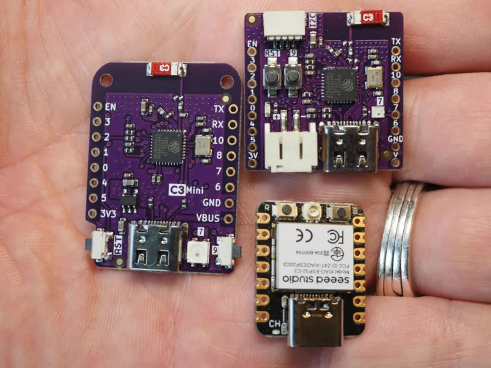

+++
layout = "post"
title = "Sleep and power usage"
date = "2023-11-17"
draft = false
+++

So I have a bunch of [these](https://www.wemos.cc/en/latest/c3/c3_mini.html) dev boards and
I'd like to try using some of them as battery-powered remote sensors
(I'm not sure yet exactly what I want to sense; maybe temperature would be a good start).
I'd like it them to last for at least a couple of weeks on a battery charge, so let's try to
figure out what my options are.

First up, roughly how much charge can we expect our battery to have? Adafruit sells rechargeable 3.7v batteries with capacities
ranging from 350mAh (for $7) to 10Ah (for $30). That's a big range, so let's just say "within an order of magnitude of 1Ah".

Next up, how much power does our chip use? We can get a very rough first guess
from the [datasheet](https://www.espressif.com/sites/default/files/documentation/esp32-c3_datasheet_en.pdf).
The current consumption is listed in Section 4.6.1:
while transmitting over wifi the current can go as high as 335 mA, which would
drain our 1Ah battery in 3 hours. At the other extreme, there is a "deep sleep"
mode that is supposed to use only 5µA. At this current, our 1Ah battery would
last more than 22 years.

Those initial estimates leave a big range, and they aren't likely to be accurate
for my usage, because those figures are just for the chip itself. Since I'm
not (yet) hardcore enough to design my own PCBs, my chips are embedded in a
development board full of other components that also use power. Since I couldn't
find anything about power consumption on the [board manufacturer's page](https://www.wemos.cc/en/latest/c3/c3_mini.html),
I guess I'll just have to measure it myself.

At this point I need to confess that I was having so much fun with my Lolin C3 Mini that I went
out and bought another couple of dev boards to see how they compare: I got some
[Lolin C3 Picos](https://www.wemos.cc/en/latest/c3/c3_pico.html) -- which are slightly
smaller than the minis and have some battery charging circuitry and a few
[Seeed Studio XIAOs](https://www.seeedstudio.com/Seeed-XIAO-ESP32C3-p-5431.html), which have
two fewer pins and are noticeably smaller than the Lolins unless you count their largish (but detachable)
external antenna. Here you can see the three of them side-by-side, with my hand for scale.

## Sleep modes

The esp32c3 has two "[sleep modes](https://docs.espressif.com/projects/esp-idf/en/latest/esp32c3/api-reference/system/sleep_modes.html#sleep-modes),"
called "light sleep" and "deep sleep." Light sleep behaves like I would expect
sleep to behave: it puts the device into a low-power state, and then after some
wakeup-trigger event it wakes up in the same state it was before going to sleep.
Deep sleep also puts the device into a low-power state and waits for some wakeup-trigger
event, but it's a bit more like a "reboot" in that when it starts back up again,
it starts back from the beginning.

Both sleep modes can be configured to wake up after a certain amount of time,
or when a specific GPIO pin gets driven high or low. So I wrote a quick test program
that runs for a little while, turns out the wifi for a little while, light-sleeps
for a little while, and deep-sleeps for a little while. I powered it from a 5v power
source and measured the power draw in the various different modes. I also varied
the CPU frequency and tried running a bit of math code in a loop to see if the
processor consumed more power.

| Board | idle@80MHz | work@80MHz | idle@160MHz | work@160MHz | wifi | light sleep | deep sleep |
| ---   | ---        | ---        | ---         | ---         | ---  | ---         | ---        |
| lolin mini | 20mA  | 21mA       | 27mA        | 31mA        | 101mA | 2.4mA      | 400µA      |
| lolin pico | 21mA  | 22mA       | 27mA        | 31mA        | 100mA | 2.6mA      | 437µA      |
| seeed xiao | 21mA  | 23mA       | 29mA        | 32mA        | 102mA | 2.5mA      | 175µA      |

Take-aways include:
- running at 160MHz takes roughly 50% more power than running at 80MHz
- doing work on the CPU uses a little more power than idling it
- the three boards use about the same power except during deep sleep, where the Seeed XIAO is the most
  efficient by a long way. Maybe this is because it lacks an RGB LED?
- we aren't getting anywhere near the 5µA deep sleep current promised by the datasheet. But still,
  deep sleep takes about 500x less power than WiFi.
