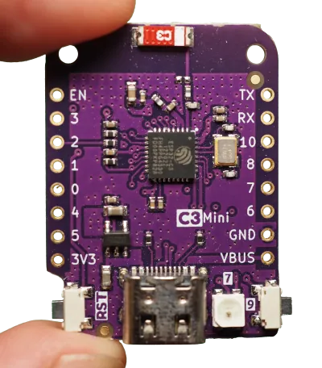

I'm a software developer most of the time, but recently -- originally inspired
by the [brachiograph](https://www.brachiograph.art/en/latest/), which is amazing
and you should make one -- I decided to dabble in embedded devices.
This is a collection of various random things I'm learning as I go.
Who is it written for? I'm not really sure. If you're also dabbling in the area,
you might find some useful tidbits. If you already know what's going on, maybe
you'll be amused by my struggles.

The goal here is learning and fun; productivity, reliability, maturity of tooling
are all optional. In particular:

- everything will be in rust: I'll be writing in rust and using rust-native tooling.
  I enjoy writing rust, so that's what it will be.
- RISC-V will be the target platform. People seem excited about it, so let's see what it's about.

After a bit of googling, I landed on the [ESP32-C3](https://www.espressif.com/en/products/socs/esp32-c3). It
has wifi and bluetooth built in, and there seems to be an active rust community in
the [esp-hal](https://github.com/esp-rs/esp-hal) project. Including, if I'm not mistaken, some employees of the
manufacturer.
I've chosen the [Lolin C3 mini](https://www.wemos.cc/en/latest/c3/c3_mini.html) as my dev board, mostly because it's
cheaply available on [AliExpress](https://www.aliexpress.us/item/3256804553736450.html?spm=a2g0o.cart.0.0.2ef938da0tl9KC&mp=1&gatewayAdapt=glo2usa&_randl_shipto=US).
This is what it looks like:


There are some [schematics](https://www.wemos.cc/en/latest/_static/files/sch_c3_mini_v2.1.0.pdf) available
and a link to the [ESP32-C3 datasheet](https://www.espressif.com/sites/default/files/documentation/esp32-c3_datasheet_en.pdf).
At some point I'll need to figure out what those things mean.

# First look at the docs

There are a number of good sources for documentation:
- The [Rust on ESP](https://esp-rs.github.io/book/introduction.html) has some
  useful instructions on how to set up projects. I learned that we have two
  possibilities: we can use [ESP-IDF](https:// docs.espressif.com/projects/esp-
  idf/en/latest/esp32c3/get-started/index.html), Espressif's SDK, via the `esp-
  idf-sys` crate. This gives us support for rust's `std` library. Or we can go
  bare-metal, using the `esp32c3-hal` crate. I couldn't find any analysis of the
  advantages or disadvantages of these two choices, so let's start with the bare
  metal version.
- There's some tutorial-style documentation in the [Embedded Rust (no_std) on
  Espressif](https://esp-rs.github.io/no_std-training/). book. It assumes you're
  using a specific board, though. Maybe I should have bought that one instead?
- The [Embedonomicon](https://docs.rust-embedded.org/embedonomicon/preface.html) seems to
  be all about ARM processors, but there are a bunch of low-level details there
  that might be important to know. Like linker scripts. I know nothing about linker scripts.

I've had less success with the [API documentation](https://docs.rs/esp32c3-
hal/0.12.0/esp32c3_hal/index.html) of the `esp32c3_hal` crate. The module
documentation is good, but I'm a bit stumped by pages like [this](https://
docs.rs/esp32c3-hal/0.12.0/esp32c3_hal/struct.Rmt.html) one. (What can I do
with the channels? `Channel0Creator<0>` doesn't seem to be public...) The day
is saved, however, by the [examples](https://github.com/esp-rs/esp-hal/tree/
main/esp32c3-hal/examples): there's a ton of them, covering a lot of different
stuff. And they're kept up-to-date, which is amazing because this stuff is under
heavy development.

# First look at the board

The biggest thing on this small board is the USB-C connector in the middle of the bottom edge.
To its right is an LED, marked with a `7`. The two bottom corners are taken up by two small buttons;
the one on the left is marked `RST` and the one on the right is marked `9`. More on those later.

The ESP32-C3 comes with integrated USB-to-JTAG support, meaning that you can flash and debug it without any
extra hardware. In this board, this functionality is hooked up
directly to the USB port, so you can get started with an ordinary USB-C cable.
(We'll see later what implications this has if you want to use the USB port for other stuff.)
The board is recognized automatically when I hook it up to my computer with a USB-C cable:

```
❯ dmesg
<...>
usb 1-2.1: New USB device found, idVendor=303a, idProduct=1001, bcdDevice= 1.01
usb 1-2.1: New USB device strings: Mfr=1, Product=2, SerialNumber=3
usb 1-2.1: Product: USB JTAG/serial debug unit
usb 1-2.1: Manufacturer: Espressif
<...>
```

# Permission to flash

Before we can actually write to the flash chip, we'll need to convince Linux to give us the necessary permissions
on the USB device. `probe-rs` has some [docs](https://probe.rs/docs/getting-started/probe-setup/) for setting
this up on "normal" Linux distributions. I'm using NixOS, though, which always has to be a little special.
To configure the flasher's permissions on NixOS, add the following to your system configuration:

```nix
# Note that I'm not using `services.udev.extraRules`, because those rules go
# in `99-local.rules` and `uaccess` needs to be set before that. I learned this
# from https://github.com/NixOS/nixpkgs/issues/210856; see also
# https://enotty.pipebreaker.pl/2012/05/23/linux-automatic-user-acl-management/ for
# more about how the uaccess tag works.
services.udev.packages = [
  (pkgs.writeTextFile {
    name = "embedded-udev-rules";
    text = ''
      ATTRS{idVendor}=="303a", ATTRS{idProduct}=="1001", TAG+="uaccess"
    '';
    destination = "/etc/udev/rules.d/69-probe.rules";
  })
];
```

I made a [NixOS module](https://github.com/jneem/probe-rs-rules) for adding these permissions.

# Hello, world!

If you're running Nix, you can get everything you need from [this](https://github.com/jneem/esp-template/) template.
It contains a flake for setting up a rust toolchain and `espflash` (a tool for flashing stuff to our esp).
It also has a `.cargo/config.toml` that I lifted from [here](https://github.com/esp-rs/esp-template) and a
`.helix/languages.toml` that gets rid of some spurious diagnostics (if you use helix).

Entering the Nix shell however you like to do that (I use direnv) and running `cargo run` should be all
you need to do. (The `.cargo/config.toml` file has some configuration to make `cargo run` flash the board using
`espflash`.)

```
❯ cargo run
Serial port: /dev/ttyACM0
Connecting...

Chip type:         ESP32-C3 (revision 3)
Crystal frequency: 40MHz
Flash size:        4MB
Features:          WiFi
MAC address:       68:67:25:b7:49:18
App/part. size:    185920/4128768 bytes, 4.50%
<...>
Hello ESP32-C3!
```

# Blinky

Next up: make the little led flash. Flashing leds are great because unlike the "hello world" example, you
really see that something is happening physically on the device.
Fortunately, `esp-hal` has an [example](https://github.com/esp-rs/esp-hal/blob/696b21bd92737f8e220a1b40bad448abecd090d3/esp32c3-hal/examples/blinky.rs)
for this. So let's copy it over to our `esp-template` and run it:

```
❯ cargo run --bin blinky
Serial port: /dev/ttyACM0
Connecting...

<...>
```

Ok, it runs but I don't see blinking. Let's look at the file we copied over:

```rust
//! Blinks an LED
//!
//! This assumes that a LED is connected to the pin assigned to `led`. (GPIO5)
```

Ah, but our board's [documentation](https://www.wemos.cc/en/latest/c3/c3_mini.html) says that
the LED is on GPIO7, not 5. Changing the 5 to a 7, and...

```
❯ cargo run --bin blinky
Serial port: /dev/ttyACM0
Connecting...

<...>
```

Still nothing. To be continued...
